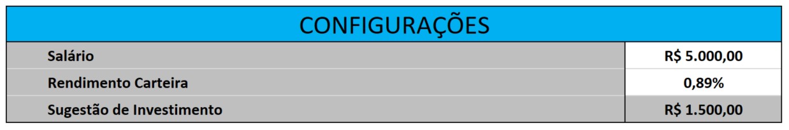
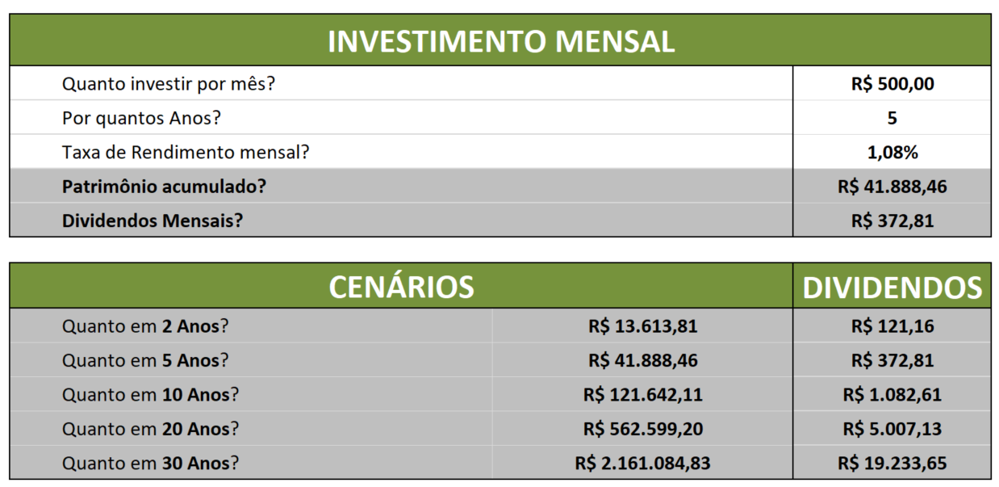
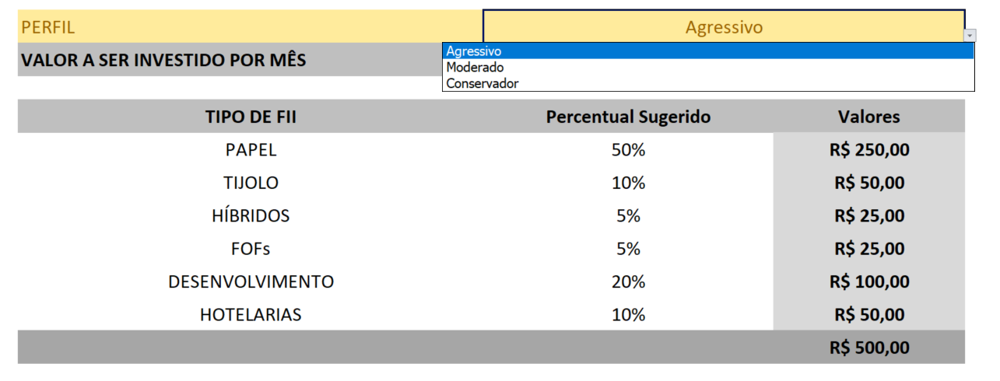

# Projeto Ferramenta de Controle de Investimento no Excel

## Imagens do projeto

CONFIGURAÇÕES: Tabela que tem por objetivo padronizar o valor do rendimento carteira (que irá ser utilizada pelas demais tabelas) e fornecer uma sugestão de investimento.
<ul>
    <li>Rendimento Carteira: Rentabilidade dos investimentos</li>
    <li>Sugestão de Investimento: Por meio do cálculo (salário * 30% do mesmo), ele fornece uma sugestão do quanto o usuário poderá investir conforme seu salário.</li>
</ul>

INVESTIMENTO MENSAL: Tabela central do projeto. Nela é possível o pratrimônio acumulado e os dividendos mensais.
<ul>
    <li>Patrimônio acumulado: Para realizar este cálculo, foi utilizado a fórmula presente no Excel: VF que basicamente <b>calcula quanto um investimento valerá no futuro</b>;</li>
    <li>Dividendos Mensais: Envolve o Patrimônio divido pelo Rendimento Carteira.</li>
</ul>
CENÁRIOS: Basicamente, seguem o mesmo modelo de cálculo, porém, não afiliada a "anos" do INVESTIMENTO MENSAL, mas sim, com número de anos exatos conforme os exemplos de cenários.

PERFIL DE INVESTIDOR: Esse é um adicional do desafio que decide praticar. Ele não é necessário para a conclusão da ideia principal. O principal foram as funcionalidades utilizadas do excel. Na parte escrita "Agressivo", posso selecionar entre dois outros perfis. Essa lista foi construída na seção de Dados - Validação de Dados.

CHAVE: Essa tabela a parte da principal, serve como uma forma de realizar a troca de dados (da tabela de PERFIL) conforme o perfil escolhido. 
Foi utilizado a fórmula PROCV que consiste em analisar uma tabela ou conjunto de informações com intuito de coletar um valor desejado conforme a palavra chave fornecida.

## Conclusão
A proposta do desafio é colocar a mão na massa e utilizar os recursos que foram ensinados durante as aulas do bootcamp com intuito de aprimorar e treinar. Esse foi só o primeiro. Então, ainda tenho um longo caminho a seguir.