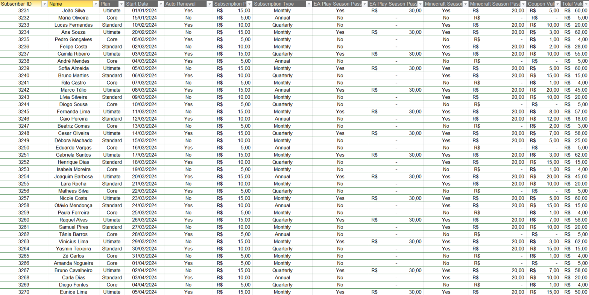
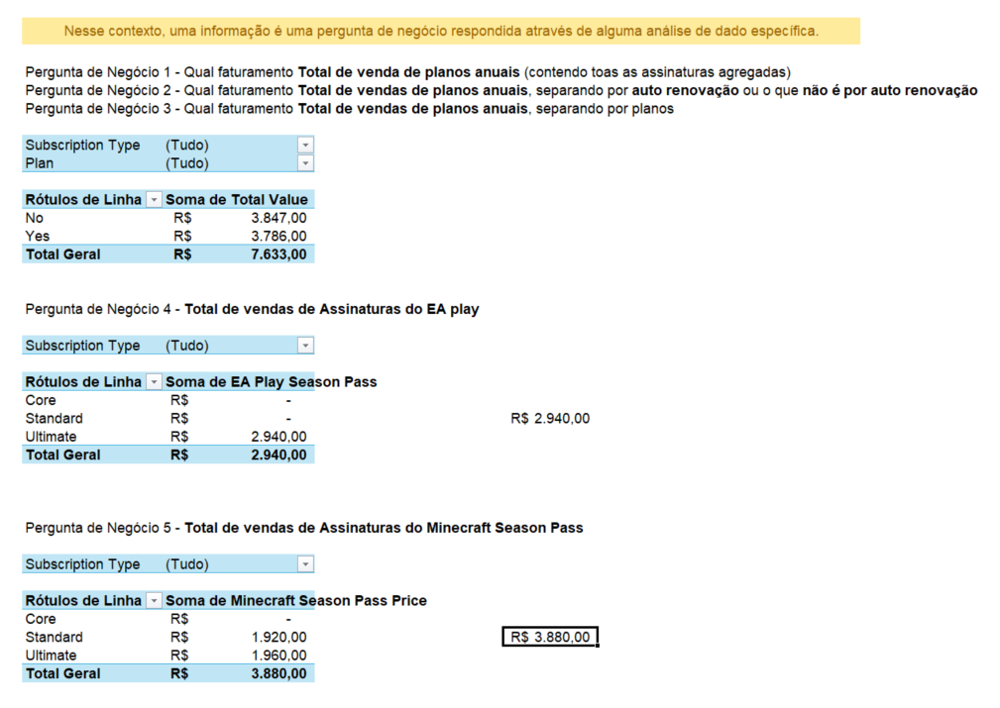
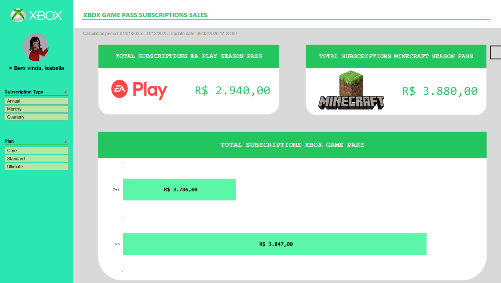

# Projeto - Dashboard de Vendas do Xbox
## Introdução

Este é o último projeto proposto no bootcamp da DIO <b> "Santander - Excel com Inteligência Artificial - 2° Semestre"</b>, o qual, deve-se construir com o auxílio do instrutor <b>Felipe Aguiar</b>, um <b>Dashboard de Vendas do Xbox</b>.

## Método ABCDE

Um método que consiste em dividir o planejamento de um dashboard em cinco partes, cada uma em planilhas separadas:
<ul style="text-align: justify;">
    <li>Assets: Planilha que armazena recursos de imagem, vídeos, gifs e paletas de cores</li>
    <li>Base: Planilha que armazena um conjunto de dados para gerar a dashboard principal</li>
    <li>Cálculos: Planilha que processa os dados para transformar em informações. Exemplo: Soma do total de vendas</li>
    <li>Dashboard: Planilha que armazena e apresenta o paínel visual das informações</li>
    <li>Extras: Uma planilha conveniente que serve para armazenar informações adicionais (Não obrigatório)</li>
</ul>

## O projeto: Imagens e descrições
### Assets

Imagens, ícones e paletas de cores que foram utilizadas na construção visual do Dashboard.

### Base

Uma parte da base de dados utilizada para ser transformada em informações .

### Cálculos

Planilha dedicada a utilizar e transformar os dados da base em informações imprescindíveis no dashboard. Sempre respondendo as perguntas de negócios.

### Dashboard

Esse é o resultado da interface e distribuição de informações do Dashboard. Ele mostra a soma total dos usuários que possuem a "EA play season pass", "Minecraft season pass" e "Xbox game pass". Filtradas por "Plano" e "Tipo de inscrição". 

